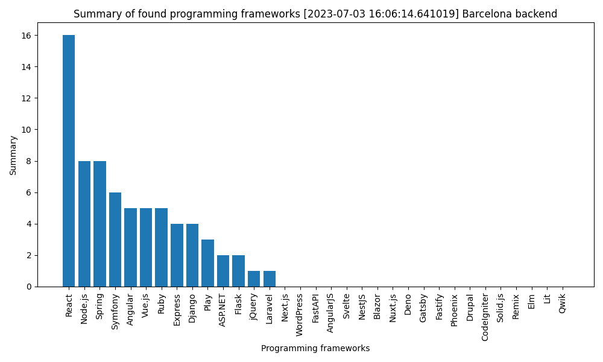
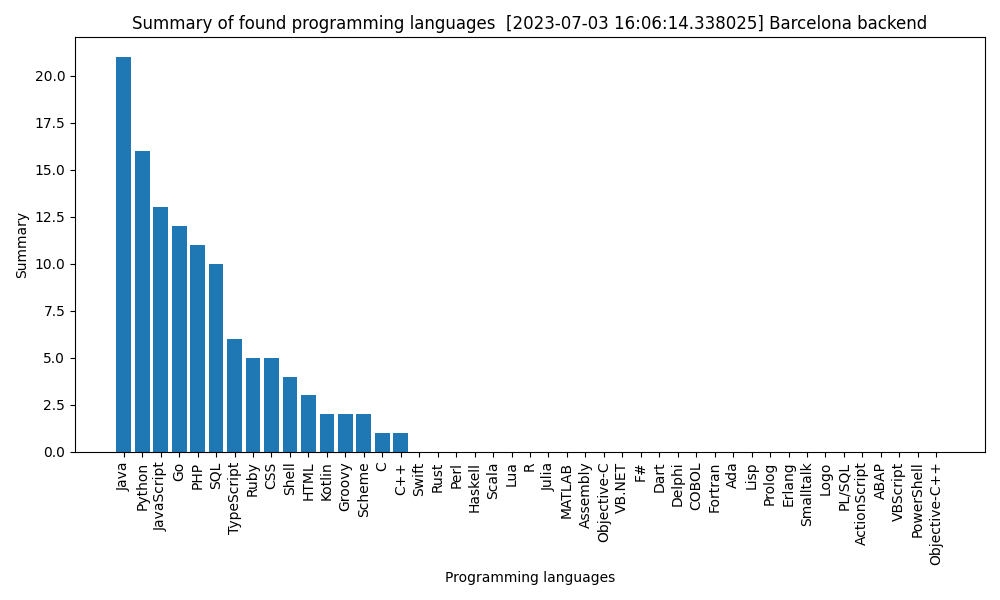

summarize_linkedin_developer_demands
====================================

This script intends to scrape LinkedIn's website by search term and location and get a short summary about the
currently trending languages and frameworks by their appearing in the posts of the job offers.
(Any idea about additional categories to be added are welcome!)

Using selenium for scraping instead of trying to access directly to LinkedIn's API, because of its cumbersome setup.
The parsing will be much slower, because of the number of steps and sleeps during runtime, but this way no auth needed.

**NOTE: If the script is breaking, that probably means they have modified the website's UI. Be nice and leave a well written issue, so I can have a look. :) **




# Install (it's just copy and run really ..)

**NOTE: Make sure sure that you install the requirements from the
"requirements.txt" file.** 

```bash
    pip install -r requirements.txt
```

**OR alternatively ...**

```bash
    conda install --file requirements.txt
```

**Also, to run selenium an installed geckodriver is a must requirement!
To install it execute the following commands:**
(I won't be always bumping the version numbers, so advisable to check out the current gecko version.)

```bash
    wget https://github.com/mozilla/geckodriver/releases/download/v0.33.0/geckodriver-v0.33.0-linux64.tar.gz
```

```bash
    sudo tar -xzvf geckodriver-v0.33.0-linux64.tar.gz -C /usr/local/bin
```

```bash
    chmod +x /usr/local/bin/geckodriver
```

# Usage

usage: summarize_linkedin_developer_demands.py [-h] [-s SEARCH_TERM] [-l LOCATION] [-n OFFER_NUM] [--headless] [--as-plots] [--plot-output PLOT_OUTPUT]

Parse LinkedIn offers for languages, frameworks, etc..

options:
  -h, --help            show this help message and exit
  -s SEARCH_TERM, --search-term SEARCH_TERM
                        Search term, like "backend" or "frontend".
  -l LOCATION, --location LOCATION
                        Location of the offers.
  -n OFFER_NUM, --offer-num OFFER_NUM
                        Minimum number of offers to be parsed to get the plots.
  --headless            Run the parsing in the background, without opening up the robot browser.
  --as-plots            Save results as plots instead of tsv .
  --plot-output PLOT_OUTPUT
                        Output directory of the plots. If directory doesn't exist, it's created auto.The default outputs can be found in the script's directory ".plot-output"

## Example:

```bash
python3 summarize_linkedin_developer_demands.py -s backend -l Barcelona -n <minimum number of offers to parse> --as-plot ---plot-output <output directory for the plots>
```

*If --as-plot flag is not given then the results will go to stdout as .tsv.*

---
